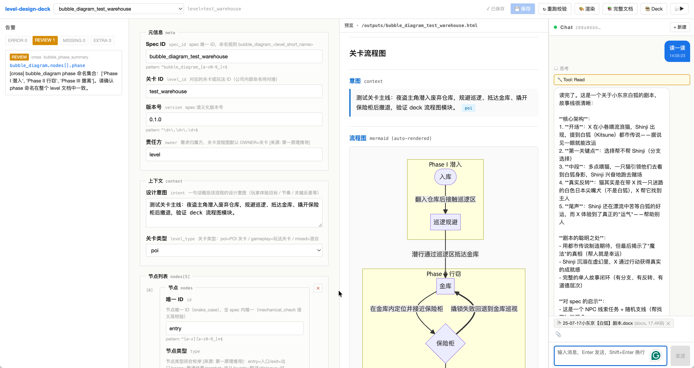

# webapp · level-design-deck Web UI + Daemon

> M4 阶段（B 阶段，分发期）的产物。在原 `editor.html` 单文件之上**新增一层** Web 应用 + 本地 daemon，
> 让 cc 在后台跑、用户在浏览器选模板 + 对话生成 spec。未来由工具组接管后端 / 局域网部署。

**当前进度（2026-05-19）：** Phase 0–4 全部完成（含 BubbleDiagramView / SpatialLayoutView / RemoteAgentRunner stub / HANDOFF.md）

---

## 是什么

`level-design-deck` 主项目把"AI 产文档 / 人通读改"换成"AI 产 spec.json / Python 标问题 / 人定向改字段"。
原 `editor.html` 是单文件无 build step 的设计工作台，**够用但不够顺手**：

- 想用对话生成新 spec，得手动跑 `tools/generate_spec.py` → 拷贝 prompt 给 cc → 拷回结果用 Write 落盘
- cc 给的参考资料只能粘文本，不能拖文件
- 多人协作 / 局域网部署完全没有

webapp 解决这三件事。架构上**与原 editor 并存**，根目录 `start.command` 跑老 editor (8766)，
webapp `start-webapp.command` 跑新 daemon（占用同 8766，自动接管）；老 editor 通过
`http://127.0.0.1:8766/legacy/editor.html` 仍可用。

---

## Quickstart

**前置：** Python 3.13 + Node 24 / npm 11+ + Claude Code CLI (`claude` 在 PATH 中)

支持平台：**macOS arm64** / **Windows 10/11 x64**（Linux 未测，理论可行）

### macOS

```bash
# 1. 装 backend（wheels 已进 git，无需联网）
cd webapp
python3 -m venv .venv
.venv/bin/pip install --no-index --find-links wheels/ fastapi 'uvicorn[standard]' pydantic pydantic-settings python-multipart watchfiles pytest httpx python-dotenv

# 2. 配 cc API 凭证
cp .env.example .env
# 编辑 .env：填入 ANTHROPIC_API_KEY（或公司 gateway 地址）

# 3. 装 frontend（可选，用于 dev 热更新；prod 已有 dist/）
cd frontend && npm install && cd ..

# 4. 启动
./start-webapp.command          # backend :8766（后台）
cd frontend && npm run dev      # frontend :5173（可选，dev 热更新）

# 5. 浏览器
open http://127.0.0.1:5173/    # dev 模式
# 或直接 open http://127.0.0.1:8766/  (prod，读 frontend/dist/)
```

### Windows

```bat
REM 1. 装 backend（注意：Windows 不用 uvicorn[standard]，uvloop 不支持）
cd webapp
python -m venv .venv
.venv\Scripts\pip install --no-index --find-links wheels\ fastapi uvicorn pydantic pydantic-settings python-multipart watchfiles pytest httpx python-dotenv

REM 2. 配 cc API 凭证
copy .env.example .env
REM 用记事本编辑 .env，填入 ANTHROPIC_API_KEY

REM 3. 启动（双击 start-webapp.bat，或在 cmd 里运行）
start-webapp.bat

REM 浏览器自动打开，或手动访问 http://127.0.0.1:8766/
```

> **Windows wheels 说明：** `webapp/wheels/` 里同时包含 macOS 和 Windows 的平台包（`win_amd64`），pip 会自动选正确的版本安装。

也可以只跑 backend 不开前端 — `http://127.0.0.1:8766/legacy/editor.html` 是老 editor 兜底。

---

## 架构

```
浏览器
  │  HTTP + WebSocket
  ▼
Vite dev server (:5173)  ──proxy──►  FastAPI (:8766)
                                       │
                  ┌────────────────────┼─────────────────┐
                  ▼                    ▼                 ▼
            SpecStore ABC        AgentRunner ABC      Services
            (FileSpecStore       (LocalCcRunner       (复用 tools/*.py
             读写 specs/)         spawn claude         不走 subprocess)
                                  CLI stream-json)
                                       │
                                       ▼
                              cc 子进程（per turn）
                              cwd=PROJECT_ROOT
                              --resume <session_id>
                              --add-dir ~/Desktop
                              --allowed-tools Read
```

- **AgentRunner / SpecStore 抽象** — Phase 4 工具组接管时只换实现，业务层不动
- **subprocess + claude CLI**（不用 claude-agent-sdk 因协议不兼容）
- **stateful resume**：cc 给的 session_id 存 server 内存，下次 `--resume` 复用上下文

总览 975 行 Python backend（17 文件，每文件 < 110 行）+ 1349 行 TypeScript frontend（20+ 文件）。

---

## 如何交互（用户视角）



四栏布局，从左到右：

1. **告警栏（左）**：spec 加载即自动跑 mechanical_check + cross_check + template_diff，
   按 ERROR/REVIEW/MISSING/EXTRA 分类统计 + 列表。点击告警跳转到对应字段 + 高亮。
   截图里左栏「REVIEW 1」即跨模块 `phase 命名集合` REVIEW（提醒人工确认 phase 命名一致）。

2. **schema 表单（中）**：顶部 spec 下拉（按 level_id 分组）→ 表单按 JSON Schema 自动渲染：
   - 字段标签**人话双显**（主标签 + 灰小字 path key，如 `Spec ID` + `spec_id`）
   - 改字段 → 顶部 dirty 红字「● 未保存」→ 点「💾 保存」→ 后端 `PUT /api/specs/{id}` 原子写
   - 嵌套对象自动折叠 fieldset，数组用 chip 列表 + 「+ 添加 / ✕ 删除」

3. **预览（中右）**：点「🎨 渲染」→ 后端 `tools.render` 出 HTML 到 `outputs/<spec_id>.html` → 同栏 iframe 自动刷新。
   截图里是 `bubble_diagram_test_warehouse` 的 mermaid 流程图（Phase I/II/III subgraph 分组）。
   顶部还有「📚 完整文档」（拼接同 level 全 module）/「🎞 Deck」（汇报用幻灯片）按钮。

4. **Chat（右）**：cc 在后台跑 stateful session，浏览器对话。
   - 「+ 新建」→ 起 WS 连接（指示灯绿 = open）→ 输入框打字 / Enter 发送
   - cc 流式回复：💭 思考折叠 + 🔧 tool_use 卡片 + 文字气泡 + cost/duration 灰小字
   - **拖文件 / 📎 picker** 到 chat → 后端自动识别后缀转 txt（`.docx/.pptx/.xlsx/.html` 调 `~/scripts/*2text.py`）→
     下条消息自动注入"附带参考文件，cc 可 Read：- /tmp/..."。截图右下「📎 25-07-17小东京【白狐】剧本.docx (docx, 17.4KB)」即附件 chip
   - 同 session 多轮，cc 记得前文（CLI `--resume <cc_session_id>`）

---

## 产出预期

**v1 (今天)：** chat 只能让 cc **讲话 + 读文件**（Read tool 唯一允许），不能让 cc 直接写 spec / 跑命令。
设计师在 chat 里讨论 → 拿到 cc 的方案 → 自己把字段填到表单 → 保存。

**Phase 3 后：** PreToolUse hook 允许 cc 调 Bash（`python3 tools/generate_spec.py ...`）+ Write 到 `specs/` 目录。
设计师能在 chat 里直接说"做一个 lighting_req for 居酒屋夜战"，cc 跑生成器写 spec → 前端文件变更 → 表单自动加载 → 设计师直接改/保存。

**Phase 4 后：** 抽 RemoteAgentRunner，工具组用他们的 gateway 接管 cc 池；加 namespace 多用户隔离；
打包给团队局域网部署。最终目标是**不会 cc 的设计师也能用**（M3.7+ 决策"app 壳"目标的落地）。

---

## 路线图

| Phase | 状态 | 内容 |
|---|---|---|
| 0 | ✅ | `tools/render_level.py` + `template_diff.py` 抽 pure function（CLI byte-identical） |
| 1 | ✅ | FastAPI backend + React/Vite/TS frontend + 三栏布局（与 editor.html 功能对齐） |
| 2 | ✅ | AgentRunner + LocalCcRunner + sessions/chat API + WebSocket + stateful resume |
| 2.5 | ✅ | LocalCcRunner `--add-dir` + 附件上传 + 后端转 txt + 附件 context 注入 |
| 3 | ✅ | BubbleDiagramView Mermaid 专用视图（点击节点跳转表单）+ SpatialLayoutView LevelCraft 集成 + Write/Bash 白名单 |
| 4 | ✅ | RemoteAgentRunner stub + namespace 贯通 + HANDOFF.md + Windows 支持 + 四栏可拖宽度 |

详细 plan：[`~/.claude/plans/federated-tickling-sparkle.md`](~/.claude/plans/federated-tickling-sparkle.md)

---

## 测试

```bash
cd webapp
PYTHONPATH=. .venv/bin/pytest backend/tests/ -v
# 当前 32 / 32 通过（specs CRUD / modules / check / render / sessions / WS chat）
```

frontend 是手动验收（无 e2e，纯交互 UI）。
